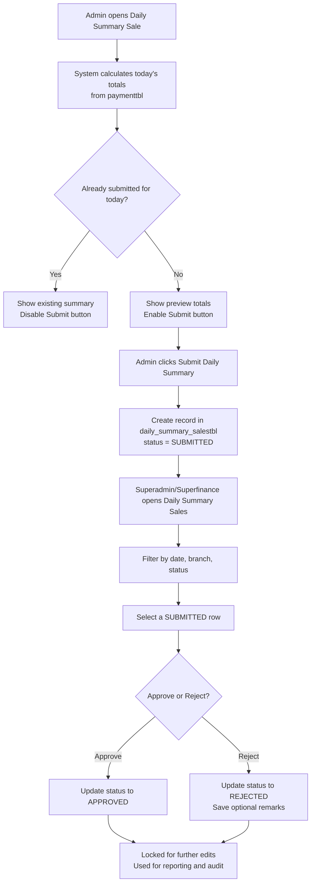

## Daily Summary Sales – Functional Workflow

### 1. Purpose

Daily Summary Sales supports **end-of-day financial closing** per branch.  
Key principles:

- **No manual amount entry** – totals are **auto-calculated** from `paymenttbl` / Payment Logs.
- **One summary per branch per day** – enforced at database level.
- **Maker–checker pattern** – Admin (maker) submits; Superadmin/Superfinance (checker) approves or rejects.

### 2. Actors & Permissions

| Role | Permissions in Daily Summary Sales |
|------|------------------------------------|
| **Admin (branch)** | Generate preview for **today**, submit today's summary for own branch. Cannot approve/reject. |
| **Superadmin** | View all branches, filter by branch/date/status, approve or reject submitted summaries. |
| **Superfinance** | Same as Superadmin but focused on financial control; can approve or reject. |
| **Finance (branch)** | **No access** to Daily Summary Sales. Uses Payment Logs and AR only. |

### 3. Status Lifecycle

Each record in `daily_summary_salestbl` moves through a simple lifecycle:

- **DRAFT (implicit, frontend only)** – Admin is just previewing totals; nothing is stored yet.
- **SUBMITTED** – Admin has confirmed today's summary; row is inserted into `daily_summary_salestbl`.
- **APPROVED** – Superadmin/Superfinance approves the summary. Record becomes read-only.
- **REJECTED** – Superadmin/Superfinance rejects the summary (optionally with a remark).

State transitions:

- `DRAFT → SUBMITTED` – Admin clicks **Submit Daily Summary**.
- `SUBMITTED → APPROVED` – Approver clicks **Approve**.
- `SUBMITTED → REJECTED` – Approver clicks **Reject**.
- `APPROVED` and `REJECTED` are **terminal** states (no further edits).

### 4. End-to-End Workflow (High Level)

### 5. Admin Branch Workflow (Daily Closing)

1. **Navigate**
   - From the sidebar, Admin opens: **Manage Invoice → Daily Summary Sale**.
2. **System pre-fills context**
   - Detect **current branch** from logged-in Admin.
   - Determine **"today"** using **Asia/Manila** timezone.
3. **Check existing submission**
   - Call **`GET /daily-summary-sales/check-today`**.
   - If a record exists (any status), show it in a read-only card/table and **hide/disable** the Submit action.
4. **Preview today's totals (only when not yet submitted)**
   - Call **`GET /daily-summary-sales/preview?date=today&branch_id=<admin_branch>`**.
   - Backend calculates:
     - `total_amount = SUM(payable_amount)`
     - `total_transactions = COUNT(*)`
     - Optional: breakdown by payment method (cash, bank, e-wallet, etc.).
   - Show the preview as:
     - Branch information
     - Summary date (today)
     - Total amount and transaction count
5. **Submit summary for today**
   - Admin reviews the preview.
   - Clicks **Submit Daily Summary**.
   - Frontend calls **`POST /daily-summary-sales`** (no manual amount field).
6. **Lock after submission**
   - Once backend confirms `SUBMITTED`:
     - Show confirmation toast/message.
     - Reload page and show the persisted summary for today in read-only mode.
     - Disable Submit button to prevent duplicates.

### 6. Superadmin / Superfinance Workflow (Review & Approval)

1. **Navigate**
   - From the sidebar, open: **Manage Invoice → Daily Summary Sales**.
2. **Global filters**
   - Filter by:
     - **Date range** or specific date.
     - **Branch** (multiple or all).
     - **Status**: Submitted, Approved, Rejected.
3. **Review submitted rows**
   - For each row with status **SUBMITTED**, show at least:
     - Branch name
     - Summary date
     - Total amount and transaction count
     - Created by / Submitted by (Admin user)
     - Created at timestamp
4. **Drill-down (optional)**
   - Provide a link/button to:
     - Open corresponding **Payment Logs** filtered by branch and summary date.
     - This lets approver verify that the total matches detailed transactions.
5. **Approve or reject**
   - Approver selects a SUBMITTED row and clicks:
     - **Approve** – updates status to `APPROVED`.
     - **Reject** – opens a small modal/textarea for **rejection reason** (optional but recommended), then updates status to `REJECTED`.
6. **Post-approval behaviour**
   - For `APPROVED` or `REJECTED`:
     - Disable further status changes in UI.
     - Keep record visible for reporting and audit.

### 7. Database Design

- **Table**: `daily_summary_salestbl`
- **Key constraints**:
  - `PRIMARY KEY (id)` (auto-increment or UUID, depending on project standard).
  - `UNIQUE (branch_id, summary_date)` – ensures only one summary per branch per day.
- **Core fields** (suggested):
  - `id`
  - `branch_id`
  - `summary_date` (DATE, in Asia/Manila context)
  - `total_amount`
  - `total_transactions`
  - `status` (`SUBMITTED`, `APPROVED`, `REJECTED`)
  - `remarks` (nullable, for rejection or notes)
  - `created_by` (Admin user id)
  - `approved_by` (nullable; approver user id)
  - `created_at`, `updated_at`
- **Amount source**:
  - `total_amount = SUM(payable_amount)` from `paymenttbl`
  - Filtered by `branch_id` and `issue_date = summary_date` (in Asia/Manila).

### 8. Backend API Contract

| Method | Path | Roles | Description |
|--------|------|-------|-------------|
| GET | `/daily-summary-sales` | Admin, Superadmin, Superfinance | List summaries. Admin: only own branch. Superadmin/Superfinance: can filter across branches. |
| GET | `/daily-summary-sales/preview?date=&branch_id=` | Admin, Superadmin, Superfinance | Return **calculated** totals from `paymenttbl` without writing to DB. |
| GET | `/daily-summary-sales/check-today` | Admin | Check if today's summary already exists for the Admin's branch. |
| POST | `/daily-summary-sales` | Admin | Create today's summary for Admin's branch using backend-calculated totals. |
| PUT | `/daily-summary-sales/:id/approve` | Superadmin, Superfinance | Approve or reject a submitted summary (payload includes action and optional remarks). |

> **Important**: No endpoint should accept a manual `total_amount` from the client. The backend must always recalculate from `paymenttbl` to avoid tampering.

### 9. Timezone Rules

- All "today" logic uses **Asia/Manila** (Philippines).
- Align:
  - Frontend date pickers and labels.
  - Backend date filtering (`issue_date`, `summary_date`).
- When in doubt, always convert from UTC to Asia/Manila before grouping/aggregating by date.

### 10. Error & Edge Case Handling

- **Duplicate submission attempt**
  - If Admin tries to submit and `(branch_id, summary_date)` already exists:
    - Backend returns a clear error (e.g., HTTP 409 Conflict).
    - Frontend shows: "Daily summary for today has already been submitted for this branch."
- **No payments for the day**
  - Preview returns `total_amount = 0`, `total_transactions = 0`.
  - Admin can still submit, resulting in a zero-amount summary (for audit completeness).
- **Permission errors**
  - Finance or other roles trying to hit these endpoints should receive 403 Forbidden.
- **Date mismatch**
  - Backend must validate that:
    - Admin can only submit **for current date** in Asia/Manila.
    - Approvers can view any date range but cannot create new summaries.
