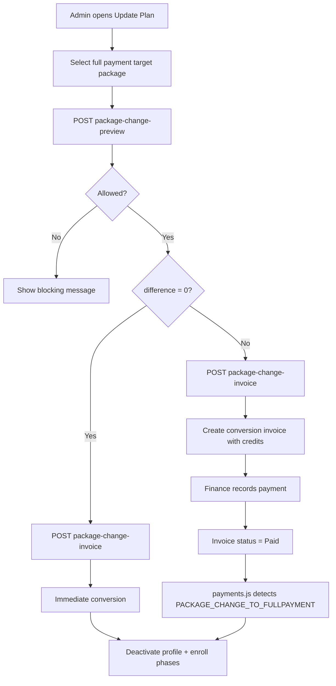

# Installment Plan → Full Payment Conversion Guide

This guide explains how a student on an **installment plan** can be **converted to full payment** using the **Update Plan** feature. The process credits all prior class-related payments and either creates a conversion invoice (when a balance remains) or completes immediately (when credits cover the full price).

**Roles:** Superadmin and Admin  
**UI location:** Classes → View Students → student action menu → **Update Plan**

---

## 1. What the Conversion Does

When an installment student is converted to a full payment package:

1. **Credits prior payments** — reservation fee, downpayment, and all completed installment/phase payments for that class are summed and applied against the full payment package price.
2. **Creates a conversion invoice** (if a balance remains) — itemized lines show the full price and separate credit lines.
3. **Finalizes on settlement** — when the conversion invoice is fully paid (or immediately when balance is zero), the system:
   - Deactivates the installment profile (`is_active = false`)
   - Cancels pending/scheduled installment invoices and unpaid profile-linked invoices
   - Enrolls the student across the **target phase range** (e.g. Phases 1–10)
   - May issue package merchandise on first qualifying payment (same rule as other full payments)

Installment-to-installment changes (switching to another installment package) are a **different** flow and are not covered here.

---

## 2. Prerequisites

The student must meet all of the following before conversion is allowed:

| Requirement | Description |
|-------------|-------------|
| Active installment profile | Exactly **one** active `installmentinvoiceprofiles_id` for the student in the class |
| Active enrollment | At least one `classstudentstbl` row with status `new`, `re_enrolled`, `upsell`, or `rejoin` |
| Current package is installment | Package type `Installment`, or `Phase` with `payment_option = Installment` |
| Target package is full payment | Package type `Fullpayment`, or `Phase` with `payment_option = Fullpayment` |
| Target package is active | Package `status = Active` and belongs to the **same branch** as the class |
| No partial recurring payment | No in-progress partial payment on a recurring phase invoice |
| Credits do not exceed target price | Total credited payments must be **≤** full payment package price |

If any rule fails, the preview shows a blocking message and the **Create Conversion Invoice** / **Convert to Full Payment** button stays disabled.

---

## 3. Where to Find It

### Superadmin

1. Go to **Classes**.
2. Open the **⋮** menu on a class → **View Students**.
3. Select a phase (or **All Phases**) → **Continue**.
4. Open the student **⋮** action menu (enrolled students only).
5. Click **Update Plan**.

### Admin

Same steps under **Admin Classes**.

---

## 4. Step-by-Step Process

### Step 1 — Open Update Plan

- From the class student list, open the student action menu and choose **Update Plan**.
- The **Update Plan** modal opens with the student name and class.

### Step 2 — Select a full payment target package

- In **Target package**, choose a **Fullpayment** package or a **Phase** package with **Fullpayment** payment option.
- Packages are filtered to:
  - Active status
  - Same branch as the class
  - Matching class level (when level tags apply)
- The student's **current** package is shown but disabled.

### Step 3 — Review the calculation preview

After selecting a target package, the system calls the preview API and displays:

| Field | Meaning |
|-------|---------|
| Current installment scope | Phase range covered by the active installment profile |
| Reservation fee credited | Completed reservation fee payments for this class |
| Downpayment & phase payments credited | Completed downpayment + installment phase payments (excludes reservation fee) |
| Total payments credited | Sum of all credits above |
| Full payment package price | `package_price` of the target full payment package |
| Enrollment after conversion | Target phase range (from package `phase_start`/`phase_end`, capped by class curriculum) |
| Balance due / Additional amount to invoice | `target_full_price − credit_total` |

**Example**

- Full payment price: ₱50,000  
- Reservation fee paid: ₱2,000  
- Downpayment + phases paid: ₱18,000  
- **Total credited:** ₱20,000  
- **Balance due:** ₱30,000 → conversion invoice created for ₱30,000

### Step 4 — Confirm conversion

Two outcomes depending on the balance:

#### A. Balance due > ₱0 — **Create Conversion Invoice**

1. Click **Create Conversion Invoice**.
2. System creates invoice `Full payment conversion - {package name}` with itemized lines:
   - Full payment price (positive line)
   - Credit: Reservation fee paid (discount line, if applicable)
   - Credit: Downpayment and installment payments (discount line)
3. Invoice remarks are tagged with `PACKAGE_CHANGE_TO_FULLPAYMENT` and metadata (`CLASS_ID`, `STUDENT_ID`, `PROFILE_ID`, `PHASE_START`, `PHASE_END`, etc.).
4. **Installment billing continues** until this invoice is paid — the profile is not deactivated yet.

#### B. Balance due = ₱0 — **Convert to Full Payment** (immediate)

1. Click **Convert to Full Payment**.
2. No invoice is created.
3. Conversion runs immediately:
   - Installment profile deactivated
   - Pending installment invoices cancelled
   - Student enrolled for all target phases

### Step 5 — Record payment (when an invoice was created)

1. Go to **Invoice** (Admin / Superadmin / Finance / Superfinance).
2. Find the conversion invoice (description: `Full payment conversion - ...`).
3. Record payment via **Record Payment** (same flow as any other invoice).
4. When the invoice status becomes **Paid**, the backend automatically completes the conversion (see Section 5).

### Step 6 — Verify results

After settlement (or immediate zero-balance conversion), confirm:

- Student has enrollment rows for phases in the target range
- Installment profile is **inactive**
- No pending installment invoices remain for that profile
- Future installment invoice generation stops for this student/class

You can also open **Installment Invoice Logs** → **View Details** on the old profile to confirm it is inactive and no further phases will generate.

---

## 5. What Happens on Settlement (Backend)

When a conversion invoice reaches **Paid** status (`POST /payments` or payment approval flow), `payments.js` detects `PACKAGE_CHANGE_TO_FULLPAYMENT` in invoice remarks and calls `applyInstallmentToFullPaymentConversion()`:

```
1. deactivateInstallmentPlanForConversion()
   ├── installmentinvoiceprofilestbl.is_active → false
   ├── installmentinvoicestbl (Pending/Scheduled) → Cancelled
   └── invoicestbl (Unpaid/Pending/Overdue, profile-linked) → Cancelled
       (conversion invoice itself is excluded)

2. enrollStudentForFullPaymentPhases()
   └── For each phase from PHASE_START to PHASE_END:
       ├── Skip if already actively enrolled
       ├── Reactivate reserved/dropped rows if present
       └── Insert new enrollment row with appropriate status:
           • First phase → new (or rejoin-aware status)
           • Middle phases → re_enrolled
           • Final phase (multi-phase) → completed

3. tryIssuePackageMerchandiseOnFirstPayment()
   └── Issues pending package merchandise if applicable
```

---

## 6. Phase Range Rules

| Package type | Target phase range |
|--------------|-------------------|
| **Fullpayment** (whole class) | Phase 1 through class `number_of_phase` (curriculum) |
| **Phase + Fullpayment** | `phase_start` through `phase_end` on the package, capped by class max phases |

Current installment scope is shown for reference only; conversion always enrolls the **target** package's full phase range, not just remaining unpaid phases.

---

## 7. Credit Calculation Details

Credits include **completed** payments only:

- Payment `status = Completed`
- Payment `approval_status ≠ Rejected`
- Invoice `status ≠ Cancelled`

**Included:**

| Source | How identified |
|--------|----------------|
| Reservation fee | Invoice linked via `reservedstudentstbl.invoice_id` for this class |
| Downpayment | Invoice linked to installment profile (`downpayment_invoice_id`) |
| Phase/installment invoices | Invoices with `installmentinvoiceprofiles_id` matching the active profile |

Reservation fee is credited separately on the invoice line items when possible; otherwise a single lump credit line is used.

---

## 8. Blocking Conditions (Reference)

| Code | Message (summary) |
|------|-------------------|
| `missing_active_profile` | No active installment profile for this class |
| `ambiguous_active_profiles` | Multiple active profiles — manual resolution required |
| `unsupported_current_package` | Student is not on an installment plan |
| `not_currently_enrolled` | No active enrollment in the class |
| `partial_recurring_payment_detected` | Partial payment in progress on a phase |
| `negative_difference_blocked` | Credits already exceed full payment price |
| `inactive_target_package` | Selected package is not active |
| `target_package_branch_mismatch` | Package branch ≠ class branch |
| `existing_adjustment_invoice` | An unpaid conversion invoice already exists |

---

## 9. API Endpoints (Technical Reference)

| Method | Endpoint | Purpose |
|--------|----------|---------|
| `POST` | `/api/sms/classes/:classId/students/:studentId/package-change-preview` | Preview credits, balance, and eligibility |
| `POST` | `/api/sms/classes/:classId/students/:studentId/package-change-invoice` | Create conversion invoice or run zero-balance conversion |
| `POST` | `/api/sms/payments` | Record payment on conversion invoice → triggers finalization |

**Request body (both preview and invoice):**

```json
{
  "target_package_id": 123
}
```

**Key backend modules:**

- `backend/lib/packageChangeConversion.js` — credits, remarks, deactivation, line items
- `backend/routes/classes.js` — preview and invoice endpoints
- `backend/routes/payments.js` — settlement trigger
- `backend/utils/fullPaymentPhaseEnrollment.js` — phase enrollment after conversion

---

## 10. Process Flow Diagram



---

## 11. Related Features

| Feature | Difference |
|---------|------------|
| **Upgrade to enrollment** (reserved student) | Converts a **reservation** to first enrollment — not an installment → full payment change |
| **Installment → installment** (Update Plan) | Switches recurring package/amount; creates adjustment invoice; profile stays active |
| **Continue per phase** | Enrolls the next single phase on a per-phase plan — not a full payment conversion |

---

## 12. Troubleshooting

| Symptom | Likely cause | Action |
|---------|--------------|--------|
| Update Plan not visible | Student is reserved/pending, not enrolled | Complete reservation upgrade or enrollment first |
| "Partial payment detected" | Earlier phase has incomplete partial payment | Finish paying the balance continuation invoice first |
| "Payments exceed full payment price" | Too much already paid vs target package | Choose a higher-priced full payment package or review payment history |
| Conversion invoice paid but phases missing | Payment recorded but invoice not fully Paid | Confirm invoice status; check server logs for conversion errors |
| Duplicate conversion invoice error | Unpaid conversion invoice already exists | Pay or cancel the existing invoice before creating another |

---

*Last updated: June 2026 — aligns with `packageChangeConversion.js` and Classes **Update Plan** modal.*
